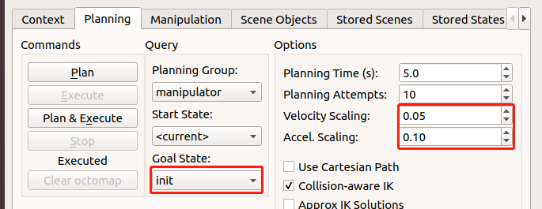

# 1. Run in Rviz

Launch opti6 rviz :
```bash
roslaunch arm_description opti6_800_view.launch [gripper:=true] [vacuum_gripper:=true]
```

# 2. Run in Rviz  and Gazebo simulator
You can launch Rviz and gazebo, and controll the arm in Rviz. When in first launch time, the arm is in vertical posture, it hard to plan trajectory, you can select the **init** posture in **MotionPlanning->Planning->Goal state** and click the **Plan & Execute** button to make arm go to the good posture.

## Launch opti6 rviz and gazebo:
1. Run gazebo first:
```bash
roslaunch opti6_800_gazebo gazebo.launch
```
2. Then in another terminal:
```bash
roslaunch opti6_800_moveit_config moveit_planning_execution.launch
```

If launch with gripper,
1. Run gazebo with gripper first:
```bash
roslaunch opti6_800_gazebo gazebo.launch gripper:=true
```
2. Then in another terminal:
```bash
roslaunch opti6_800_moveit_gripper_config moveit_planning_execution.launch
```
## Launch opti7 rviz and gazebo:
1. Run gazebo first:
```bash
roslaunch opti7_800_gazebo gazebo.launch
```
2. Then in another terminal:
```bash
roslaunch opti7_800_moveit_config moveit_planning_execution.launch
```

If launch with gripper,
1. Run gazebo with gripper first:
```bash
roslaunch opti7_800_gazebo gazebo.launch gripper:=true
```
2. Then in another terminal:
```bash
roslaunch opti7_800_moveit_gripper_config moveit_planning_execution.launch
```

# 3. Run Rviz and connect with opti
You can connect with opti and controll it in rviz.
**Pay Attention** you need to very be careful the **Trajectory planning** in rviz , you must **Play** before the **Excute** every time to make sure that the generated trajectory is not **Collision**. We suggest that make opti with a good posture by select the **init** posture in **MotionPlanning->Planning->Goal state**. For Safe on Execute, we suggest you set the Velocity and Accel smaller first.
  

## 3.1 Launch the server to connect the arm

```bash
roslaunch arm_controller utarm_api_server.launch arm_ip:="opti_ip_address"   //opti_ip_address like 192.168.1.234
```
## 3.2 Enable the opti

you need open the opti studio to enable the opti 

## 3.3 Open the Rviz

please install the ros_industrial: <https://github.com/ros-industrial/industrial_core>(remember to select your correct ROS distribution) 

Launch the Rviz and connect the opti6
```bash
roslaunch opti6_800_moveit_config run_with_opti6_800.launch 
```

## 3.4 Open the Rviz with gripper

please install the ros_industrial: <https://github.com/ros-industrial/industrial_core>(remember to select your correct ROS distribution) , *Notice, do not excute 3.3 command at the same time*

Launch the Rviz with gripper and connect the opti6
```bash
roslaunch opti6_800_moveit_gripper_config run_with_opti6_800.launch 
```


# 4. Excute the command to communicate with server 
All servers are implemented in utarm_api_server.cpp of arm_controller package.

All msg are in ut_msg package.

## 4.1 Communication with opti through the rosservice command


Connect service, refer to [Connect.srv](/ut_msg/srv/Connect.srv),[Disconnect.srv](/ut_msg/srv/Disconnect.srv),[CheckConnect.srv](/ut_msg/srv/CheckConnect.srv)

```
rosservice call /utsrv/connect "192.168.1.234" 
rosservice call /utsrv/disconnect 
rosservice call /utsrv/check_connect 
```

Gripper service, refer to [SetGripperState.srv](/ut_msg/srv/SetGripperState.srv),[GetGripperState.srv](/ut_msg/srv/GetGripperState.srv),[Grippermv.srv](/ut_msg/srv/Grippermv.srv)

```
rosservice call /utsrv/gripper_state_set 1  
rosservice call /utsrv/gripper_state_get 
rosservice call /utsrv/gripper_mv 20
```
more service introduction [service.md](/arm_controller/readme.md)

# 5. Opti Rviz plugin

You can open the opti rviz plugin by select Menu->Panels->utra_rviz->utra_panel
  

In this panel, you can enable the arm and set the gripper more easy.

  


