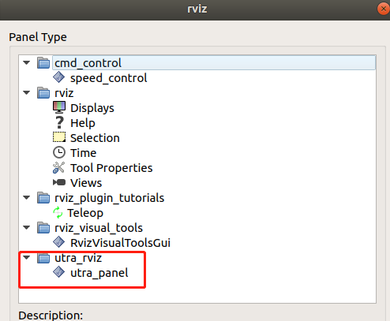
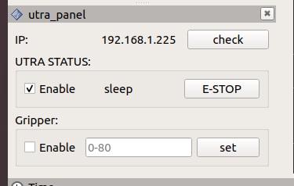

# 1. Introduction
This repository contains the 3D models of utra series and demo packages for ROS development and simulations.Developing and testing environment: Ubuntu 18.04 + ROS melodic + Gazebo 9.  


# 2. Preparations before using this package

## 2.1 Install dependent package module
gazebo_ros_pkgs: <http://gazebosim.org/tutorials?tut=ros_installing> (if use Gazebo)   
ros_control: <http://wiki.ros.org/ros_control> (remember to select your correct ROS distribution)  
moveit_core: <https://moveit.ros.org/install/>  
ros_industrial: <https://github.com/ros-industrial/industrial_core>(remember to select your correct ROS distribution)  
   
## 2.2 Go through the official tutorial documents
ROS Wiki: <http://wiki.ros.org/>  
Gazebo Tutorial: <http://gazebosim.org/tutorials>  
Gazebo ROS Control: <http://gazebosim.org/tutorials/?tut=ros_control>  
Moveit Tutorial: <http://docs.ros.org/kinetic/api/moveit_tutorials/html/>  

## 2.2 Install "mimic_joint_plugin"
if you use Gripper in Gazebo, you need to install the [mimic_joint_plugin](https://github.com/roboticsgroup/roboticsgroup_gazebo_plugins) for make the mimic joints behave normally. if you use [new version](https://github.com/roboticsgroup/roboticsgroup_upatras_gazebo_plugins), please change "libroboticsgroup_gazebo_mimic_joint_plugin.so" to "libroboticsgroup_upatras_gazebo_mimic_joint_plugin.so" in file: utra_ros/utra_gripper/urdf/gripper.transmission.xacro

# 3. Getting started with 'utra_ros'
   
## 3.1 Create a catkin workspace. 
If you already have a workspace, skip and move on to next part.
Follow the instructions in [this page](http://wiki.ros.org/catkin/Tutorials/create_a_workspace). 
Please note that this readme instruction assumes the user continues to use '~/catkin_ws' as directory of the workspace.

## 3.2 Obtain the package
   ```bash
   cd ~/catkin_ws/src
   git clone https://github.com/UmbraTek/utra_ros
   ```
## 3.3 Install other dependent packages:
   ```bash
   rosdep update
   rosdep check --from-paths . --ignore-src --rosdistro melodic
   ```
   Please change 'melodic' to the ROS distribution you use. If there are any missing dependencies listed. Run the following command to install:  
   ```bash
   rosdep install --from-paths . --ignore-src --rosdistro melodic -y
   ```
   And change 'melodic' to the ROS distribution you use.  

## 3.4 Build the code
   ```bash
   cd ~/catkin_ws
   catkin_make
   ```
## 3.5 Source the setup script
```bash
echo "source ~/catkin_ws/devel/setup.bash" >> ~/.bashrc
```
Skip above operation if you already have that inside your ~/.bashrc. Then do:
```bash
source ~/.bashrc
```
# 4. Run in RViz
Launch utra 550 rviz :
```bash
roslaunch utra_description utra6_550_view.launch [gripper:=true] [vacuum_gripper:=true]
```
Launch utra 850 rviz :
```bash
roslaunch utra_description utra6_850_view.launch [gripper:=true] [vacuum_gripper:=true]
```
Launch utra 1000 rviz :
```bash
roslaunch utra_description utra6_1000_view.launch [gripper:=true] [vacuum_gripper:=true]
```

# 5. Run in RViz  and Gazebo simulator
You can launch Rviz and gazebo, and controll the arm in Rviz. When in first launch time, the arm is in vertical posture, it hard to plan trajectory, you can select the **init** posture in **MotionPlanning->Planning->Goal state** and click the **Plan & Execute** button to make arm go to the good posture.

Launch utra 850 rviz and gazebo:
1. Run gazebo first:
```bash
roslaunch utra6_850_gazebo gazebo.launch
```
2. Then in another terminal:
```bash
roslaunch utra6_850_moveit_config moveit_planning_execution.launch
```
If launch with gripper,
1. Run gazebo with gripper first:
```bash
roslaunch utra6_850_gazebo gazebo.launch gripper:=true
```
2. Then in another terminal:
```bash
roslaunch utra6_850_moveit_gripper_config moveit_planning_execution.launch
```

# 6. Run RViz and connect with utra
You can connect with utra and controll it in rviz.
**Pay Attention** you need to very be careful the **Trajectory planning** in rviz , you must **Play** before the **Excute** every time to make sure that the generated trajectory is not **Collision**. We suggest that make utra with a good posture by select the **init** posture in **MotionPlanning->Planning->Goal state**.

## 6.1 Launch the server to connect the utra

```bash
roslaunch utra_controller utra_server.launch utra_ip:="utra_ip_address"   //utra_ip_address like 192.168.1.234
```
## 6.2 Enable the utra

you need open the utra studio to enable the utra 

## 6.3 Open the Rviz

please install the ros_industrial: <https://github.com/ros-industrial/industrial_core>(remember to select your correct ROS distribution) 

Launch the Rviz and connect the utra 550
```bash
roslaunch utra6_550_moveit_config run_with_utra.launch 
```
Launch the Rviz and connect the utra 850
```bash
roslaunch utra6_850_moveit_config run_with_utra.launch 
```

Launch the Rviz and connect the utra 1000
```bash
roslaunch utra6_1000_moveit_config run_with_utra.launch 
```

## 6.3 Open the Rviz with gripper

Launch the Rviz and connect the utra 550
```bash
roslaunch utra6_550_moveit_config run_with_utra.launch 
```
Launch the Rviz and connect the utra 850
```bash
roslaunch utra6_850_moveit_config run_with_utra.launch 
```

Launch the Rviz and connect the utra 1000
```bash
roslaunch utra6_1000_moveit_gripper_config run_with_utra.launch 
```

# 7. Excute the command to communicate with server 
All servers are implemented in utra_server.cpp of utra_controller package.

All msg are in utra_msg package.

## 7.1 Communication with utra through the rosservice command


Connect service, refer to [Connect.srv](/utra_msg/srv/Connect.srv),[Disconnect.srv](/utra_msg/srv/Disconnect.srv),[Checkconnect.srv](/utra_msg/srv/Checkconnect.srv)

```
rosservice call /utra/connect "192.168.1.234" 
rosservice call /utra/disconnect 
rosservice call /utra/check_connect 
```

Gripper service, refer to [GripperStateSet.srv](/utra_msg/srv/GripperStateSet.srv),[GripperStateGet.srv](/utra_msg/srv/GripperStateGet.srv),[Grippermv.srv](/utra_msg/srv/Grippermv.srv)

```
rosservice call /utra/gripper_state_set 1  
rosservice call /utra/gripper_state_get 
rosservice call /utra/gripper_mv 20
```
more service introduction [service.md](/utra_controller/readme.md)

# 8. Utra Rviz plugin

you can open the utra rviz plugin by select Menu->Panels->utra_rviz->utra_panel
  

In this panel, you can enable the utra and set the gripper more easy.
  